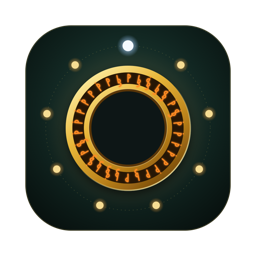

<p align="center">
  
</p>

<h1 align="center">Fellowship</h1>

<p align="center">
  Rode Claude Code, Codex, OpenCode e Cursor Agent lado a lado, como terminais de verdade,<br>
  e deixe um deles liderar os outros.
</p>

<p align="center">
  <a href="README.md">English</a> · <b>Português</b>
</p>

---

## O que é

O Fellowship é um aplicativo de desktop para trabalhar com vários agentes de código ao mesmo tempo. Cada agente é o
**CLI de verdade** rodando no próprio terminal: você lê, digita nele, e ele mantém o login e as atualizações dele. O
Fellowship acrescenta o que esses CLIs não têm entre si: um lugar para rodá-los juntos, um jeito de transformar um
deles em **orquestrador** que repassa trabalho aos outros, e tudo isso também numa **máquina remota via SSH**.

Nada para instalar além dos agentes que você quer usar. Sem tmux, sem Node: o app traz o próprio runtime.

> O código-fonte do Fellowship é privado. Este repositório só publica os instaladores.

## O que ele faz

- **Terminais de verdade, não uma casca de chat.** Claude Code, Codex, OpenCode e Cursor Agent rodam exatamente como no
  seu terminal. O Fellowship nunca edita a configuração deles: seus hooks e seu servidor MCP entram por sessão.
- **Um orquestrador que delega.** Qualquer agente pode coordenar: ele inicia workers, manda mensagens, espera os
  resultados e acompanha as tarefas. Os workers respondem com um resultado estruturado. Você ainda pode intervir e
  digitar em qualquer um.
- **Workspaces.** Um por projeto, cada um com seus agentes, tarefas e atividade. Os outros workspaces mostram quantos
  agentes seus estão esperando por você.
- **Times salvos.** Um orquestrador e seus membros (papel, CLI, nome, worktree, primeira mensagem), iniciados com um clique.
- **Agentes remotos via SSH.** Adicione um host (`usuario@host`) e rode agentes numa VPS ou numa máquina de build. O
  Fellowship instala ali um pequeno serviço próprio, na sua pasta pessoal e sem root, e o alcança por um túnel SSH.
  Qualquer coisa que altere o host (instalar o Node, atualizar o serviço) espera a sua aprovação.
- **Terminais simples**, nesta máquina ou num host, para quando você só precisa de um shell.
- **Seguro por padrão.** Uma mensagem nunca é digitada num agente ocupado ou esperando uma permissão: ela entra numa
  fila até o agente ficar ocioso. Só você responde aos pedidos de aprovação.
- **Git worktrees.** Um worker pode ter o próprio checkout e branch, e workers em paralelo não colidem. Revise o que um
  worker produziu e remova o checkout dele pelo app.
- **Retomar.** Traga um agente de volta depois que ele terminou, na mesma pasta, com o mesmo nome e lugar no time.
- **Notificações.** Uma notificação do sistema (e o contador no ícone) quando um agente precisa de você, e, se quiser,
  quando um termina o trabalho. Um orquestrador ocioso é acordado quando um dos workers responde.
- **Configuração de lançamento por workspace.** Defina comando, argumentos e ambiente para cada CLI, no geral ou só
  dentro de um workspace. É assim que uma máquina usa duas contas do mesmo CLI, por exemplo um `CLAUDE_CONFIG_DIR`
  diferente em cada workspace.
- **Papéis e seus próprios CLIs.** Defina papéis (instruções, CLI, modelo, worktree) e cadastre qualquer agente de
  terminal que o Fellowship ainda não conheça.
- **Atualizações.** O app verifica uma vez por dia, confere o que baixa, instala e reinicia.
- **Inglês e português do Brasil.**

## Instalação

Baixe o arquivo do seu sistema na [última versão](../../releases/latest).

### macOS (Apple silicon)

1. Baixe `Fellowship-<versão>-mac-arm64.dmg`, abra e arraste o **Fellowship** para **Aplicativos**.
2. O app é assinado de forma ad hoc, e não com um Apple Developer ID pago, então o macOS pede a sua aprovação na
   primeira vez:
   - **macOS 15 ou mais novo:** abra o Fellowship uma vez (ele será bloqueado), depois vá em **Ajustes do Sistema →
     Privacidade e Segurança**, role até o fim e escolha **Abrir Mesmo Assim**.
   - **macOS mais antigo:** clique com o botão direito no app e escolha **Abrir**.
   - Ou, pelo terminal: `xattr -dr com.apple.quarantine /Applications/Fellowship.app`

### Windows (x64)

1. Baixe `Fellowship-<versão>-win-x64.exe` e execute.
2. O instalador não é assinado, então o SmartScreen avisa: escolha **Mais informações** e depois **Executar assim mesmo**.

### Linux (x64)

Escolha um:

- **AppImage** (se atualiza sozinho):
  ```sh
  chmod +x Fellowship-<versão>-linux-x86_64.AppImage
  ./Fellowship-<versão>-linux-x86_64.AppImage
  ```
  Se não abrir, pode faltar o FUSE 2 no sistema (`sudo apt install libfuse2` no Debian e no Ubuntu).
- **Pacote para Debian e Ubuntu** (atualizado baixando um pacote novo desta página):
  ```sh
  sudo apt install ./Fellowship-<versão>-linux-amd64.deb
  ```

### Primeiro uso

1. Instale os CLIs de agentes que quer usar e entre em cada um como você já faz. O Fellowship usa o `claude`, o
   `codex`, o `opencode` e o `cursor-agent` que encontrar no seu `PATH`; em **Configurações → CLIs de agentes** dá para
   apontar outro comando.
2. Abra o Fellowship, crie um **workspace** (um nome e a pasta do projeto) e depois **Novo agente**.
3. Escolha um papel. Um `orchestrator` coordena os outros; qualquer outro papel trabalha sozinho.

Para rodar agentes em outra máquina: **Configurações → Hosts → Adicionar um host** e escolha esse host ao criar o
workspace. O host precisa de acesso SSH por chave ou agente, e pode ser Linux ou macOS, x64 ou arm64.

## Atualizações

O Fellowship procura uma versão nova quando abre e depois uma vez por dia, e avisa quando há uma. **Configurações →
Geral → Atualizações** mostra a versão que você usa e tem **Verificar atualizações** e **Baixar e reiniciar**. Todo
instalador é publicado com um arquivo `.sha256`, e o app descarta um download que não confere. Seus agentes continuam
rodando durante a atualização; o app pergunta antes de reiniciar o serviço em segundo plano onde eles vivem.

No Linux com o `.deb`, o app só abre esta página: instale o pacote novo como acima.

## Dados de uso

O Fellowship envia **dados de uso anônimos** para que o mantenedor veja quais recursos são usados e onde o tempo é
gasto. Vem **ligado por padrão**. Desligue quando quiser em **Configurações → Geral → Compartilhar dados de uso
anônimos**; o envio para na hora e o que ainda esperava para ser enviado é apagado.

**Nada que identifique você é coletado.** Nem nome, e-mail ou conta. E nunca seus prompts, mensagens ou saída dos
agentes, código, caminhos de arquivos ou pastas, nomes de repositório, branch, workspace ou host, destinos SSH,
variáveis de ambiente ou argumentos de comandos. Só contagens, durações e valores de uma lista fixa (por exemplo, qual
CLI um agente usa, ou se um workspace é local ou via SSH).

O que cada instalação carrega: um ID aleatório gerado na primeira execução, que não vem da sua máquina nem da sua conta,
mais a versão do app, o sistema operacional, a arquitetura da CPU, o idioma e o tamanho da tela. O servidor usa o
endereço IP da conexão apenas para descobrir o país, e não o guarda. Sem cookies.

Os dados vão para uma instância [Umami](https://umami.is) própria do mantenedor, que não os compartilha. Builds
executados a partir do código-fonte não enviam nada.

## Estado atual

O Fellowship é jovem (versões 0.x) e muda rápido.

- Retomar está verificado com o Claude Code; no Codex, OpenCode e Cursor Agent depende de ids de conversa que ainda
  não foram testados com conversas reais.
- As versões para Windows e Linux são publicadas, mas tiveram bem menos uso que a do macOS.
- Os hosts remotos foram usados em Linux x64.
